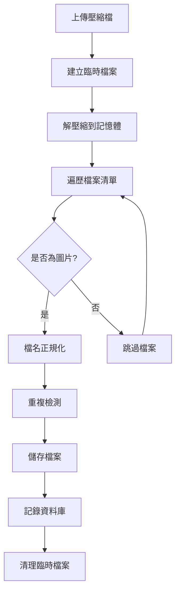

# 照片上傳系統規格設計文檔
# 文件目的：記錄照片上傳系統的完整架構設計、功能規格和技術實作
# 主要功能：提供系統開發、維護和擴展的技術參考文檔

## 🎯 系統概覽

### 系統目標
提供一個多專案、多格式、高效能的照片管理系統，支援圖片上傳、壓縮檔案解壓縮、重複檢測和檔案組織管理。

### 核心價值
- **專案隔離**：多專案獨立管理，避免檔案混淆
- **格式豐富**：支援多種圖片和壓縮檔案格式
- **智能處理**：自動檔名正規化、重複檢測、解壓縮
- **高可靠性**：完整的錯誤處理、日誌追蹤、資料備份

## 🏗️ 技術架構

### 三層式架構設計

#### 1. 前端層 (Angular)
```typescript
PhotoUploadService
├── 檔案類型驗證
├── 上傳進度追蹤
├── HTTP通訊管理
└── 錯誤處理
```

#### 2. 控制器層 (.NET Core)
```csharp
PhotoUploadController
├── API路由管理
├── 請求參數驗證
├── 異常處理包裝
└── 回應格式標準化
```

#### 3. 服務層 (.NET Core)
```csharp
PhotoUploadService
├── 檔案處理邏輯
├── 資料庫操作
├── 檔案系統管理
└── 業務規則實施
```

### 技術堆疊
- **後端框架**：.NET Core 8.0
- **前端框架**：Angular (Standalone Components)
- **資料庫**：PostgreSQL 14+
- **ORM工具**：Dapper
- **壓縮處理**：SharpCompress
- **日誌系統**：Serilog
- **HTTP客戶端**：Angular HttpClient

## 🚀 功能特性規格

### 1. 多格式支援
#### 圖片格式
- **JPG/JPEG**：標準JPEG圖片格式
- **PNG**：透明背景圖片格式

#### 壓縮檔案格式
- **ZIP**：標準ZIP壓縮檔案
- **7Z**：7-Zip壓縮檔案

#### 檔案大小限制
- **單檔限制**：50MB
- **批量上傳**：無數量限制（ZIP/7Z內檔案）

### 2. 專案分離機制
#### 目錄結構
```
photos/
├── [project_id_1]/
│   ├── 000001.jpg
│   ├── 000002.png
│   └── photo.jpg
├── [project_id_2]/
│   ├── 000001.jpg  ← 允許跨專案重複檔名
│   └── document.png
└── [project_id_3]/
    └── archive_photos/
```

#### 隔離特性
- **檔案隔離**：不同專案檔案存放在獨立目錄
- **查詢隔離**：API查詢結果按專案過濾
- **權限隔離**：專案ID必須驗證
- **統計隔離**：各專案獨立統計檔案數量和大小

### 3. 智能檔名處理

#### 正規化規則
```
規則：純數字檔名補零至6位數
範例：
  4.PNG      → 000004.PNG
  12.jpg     → 000012.jpg
  123.png    → 000123.png
  123456.PNG → 123456.PNG (已6位，保持原樣)
  photo.jpg  → photo.jpg  (非數字，保持原樣)
```

#### 重複處理規則
```
規則：檔名衝突時自動添加序號
範例：
  000004.PNG → 000004.PNG     (首次)
  000004.PNG → 000004-1.PNG   (重複)
  000004.PNG → 000004-2.PNG   (再次重複)
```

### 4. 重複檢測機制
#### MD5雜湊檢測
- **範圍**：同專案內檔案
- **演算法**：MD5雜湊值計算
- **約束**：唯一約束 `(project_id, md5_hash)`
- **行為**：重複檔案返回已存在的檔案資訊

#### 檢測流程
1. 計算上傳檔案MD5值
2. 查詢同專案內是否存在相同MD5
3. 如存在：返回已存在檔案資訊，不重複儲存
4. 如不存在：繼續上傳流程

### 5. 壓縮檔案處理
#### 解壓縮特性
- **自動檢測**：根據副檔名自動識別壓縮格式
- **遞歸解壓**：處理ZIP/7Z內的所有檔案
- **圖片過濾**：只處理圖片格式檔案，跳過其他格式
- **錯誤隔離**：單個檔案失敗不影響其他檔案處理

#### 處理流程


## 🗃️ 資料庫設計規格

### 主表：photos
#### 欄位設計
| 欄位名 | 類型 | 說明 | 約束 |
|--------|------|------|------|
| id | INTEGER | 主鍵 | PK, AUTO_INCREMENT |
| original_filename | VARCHAR(255) | 原始檔名 | NOT NULL |
| saved_filename | VARCHAR(255) | 儲存檔名 | NOT NULL |
| file_path | TEXT | 完整檔案路徑 | NOT NULL |
| file_size | BIGINT | 檔案大小(bytes) | NOT NULL |
| md5_hash | VARCHAR(32) | MD5雜湊值 | NOT NULL |
| project_id | VARCHAR(50) | 專案ID | NOT NULL |
| upload_time | TIMESTAMP | 上傳時間 | DEFAULT NOW() |
| created_at | TIMESTAMP | 建立時間 | DEFAULT NOW() |
| updated_at | TIMESTAMP | 更新時間 | DEFAULT NOW() |

#### 索引策略
```sql
-- 主鍵索引
PRIMARY KEY (id)

-- 查詢最佳化索引
CREATE INDEX idx_photos_project_id ON photos(project_id);
CREATE INDEX idx_photos_md5_hash ON photos(md5_hash);
CREATE INDEX idx_photos_upload_time ON photos(upload_time);

-- 複合索引
CREATE INDEX idx_photos_project_md5 ON photos(project_id, md5_hash);

-- 唯一約束
CREATE UNIQUE INDEX uk_photos_project_md5 ON photos(project_id, md5_hash);
```

### 擴展表：photo_tags
#### 用途
- 照片與人員關聯
- 照片分類標籤
- 地點標記
- 自定義標籤

#### 欄位設計
| 欄位名 | 類型 | 說明 | 約束 |
|--------|------|------|------|
| id | INTEGER | 主鍵 | PK, AUTO_INCREMENT |
| photo_id | INTEGER | 照片ID | FK, NOT NULL |
| tag_type | VARCHAR(50) | 標籤類型 | NOT NULL |
| tag_value | VARCHAR(100) | 標籤值 | NOT NULL |
| project_id | VARCHAR(50) | 專案ID | NOT NULL |
| created_at | TIMESTAMP | 建立時間 | DEFAULT NOW() |

#### 關聯設計
```sql
-- 外鍵約束
FOREIGN KEY (photo_id) REFERENCES photos(id) ON DELETE CASCADE

-- 唯一約束
UNIQUE (photo_id, tag_type, tag_value)
```

## 🔌 API 設計規格

### RESTful API 端點

#### 1. 照片上傳
```http
POST /api/PhotoUpload/upload
Content-Type: multipart/form-data

Parameters:
- file: 上傳檔案 (required)
- project_id: 專案ID (required)

Response:
{
  "success": true,
  "message": "照片上傳成功",
  "data": {
    "uploadedFiles": [...],
    "failedFiles": [...],
    "totalUploaded": 5,
    "totalFailed": 0
  }
}
```

#### 2. 照片列表查詢
```http
GET /api/PhotoUpload/list?project_id={project_id}

Response:
{
  "success": true,
  "data": [
    {
      "id": 1,
      "originalFileName": "0004.PNG",
      "savedFileName": "000004.PNG",
      "fileSize": 24041,
      "uploadTime": "2025-01-24T03:05:12.098Z"
    }
  ]
}
```

#### 3. 照片刪除
```http
DELETE /api/PhotoUpload/{id}

Response:
{
  "success": true,
  "message": "照片刪除成功"
}
```

#### 4. 照片檔案服務
```http
GET /api/PhotoUpload/{id}/file
GET /api/PhotoUpload/file/{filename}?project_id={project_id}

Response: Binary file data
Content-Type: image/jpeg | image/png
```

#### 5. 服務健康檢查
```http
GET /api/PhotoUpload/health

Response:
{
  "success": true,
  "data": {
    "service": "PhotoUploadController",
    "status": "healthy",
    "supportedFormats": ["jpg", "jpeg", "png", "zip", "7z"],
    "features": ["專案分離", "ZIP/7Z解壓縮", "重複檢測", "檔名處理"]
  }
}
```

## 📁 檔案系統設計

### 目錄結構規範
```
familytree-backend/
├── photos/                     # 照片根目錄
│   ├── {project_id_1}/        # 專案1照片目錄
│   │   ├── 000001.jpg
│   │   ├── 000002.png
│   │   └── custom_name.jpg
│   ├── {project_id_2}/        # 專案2照片目錄
│   │   └── 000001.jpg
│   └── {project_id_3}/        # 專案3照片目錄
│       ├── 000001.png
│       └── batch_upload/
└── logs/                       # 日誌目錄
    ├── familytree-analysis-2025-01-24.log
    └── ...
```

### 檔案命名約定
- **專案目錄**：使用project_id作為目錄名
- **照片檔案**：經過正規化處理的檔名
- **權限設定**：確保Web服務有讀寫權限
- **備份策略**：定期備份photos目錄

## 🔒 安全性設計

### 檔案驗證
#### 檔案類型驗證
```csharp
// 副檔名白名單
private static readonly string[] AllowedExtensions = 
    { ".jpg", ".jpeg", ".png", ".zip", ".7z" };

// MIME類型驗證
private static readonly string[] AllowedMimeTypes = 
    { "image/jpeg", "image/png", "application/zip", "application/x-7z-compressed" };
```

#### 檔案大小限制
- **單檔限制**：50MB (可設定)
- **總量限制**：專案級別可擴展
- **解壓縮限制**：壓縮檔案內容總大小檢查

### 路徑安全
- **路徑遍歷防護**：檔名和路徑清理
- **專案隔離**：強制project_id驗證
- **檔案存取控制**：透過API存取，不直接暴露檔案路徑

### 資料完整性
- **MD5驗證**：檔案完整性檢查
- **事務處理**：資料庫操作原子性
- **錯誤回滾**：失敗時清理已建立的檔案

## 📊 效能設計

### 資料庫效能
- **索引策略**：針對查詢模式建立最佳索引
- **分頁查詢**：大量照片時支援分頁
- **連接池**：資料庫連接複用
- **查詢最佳化**：避免N+1查詢問題

### 檔案處理效能
- **串流處理**：大檔案串流上傳和下載
- **非同步處理**：上傳過程非阻塞
- **記憶體管理**：及時釋放臨時檔案和記憶體
- **批量處理**：ZIP檔案批量解壓縮

### 前端效能
- **進度追蹤**：即時顯示上傳進度
- **錯誤處理**：友善的錯誤訊息
- **檔案預覽**：上傳前檔案資訊顯示
- **快取策略**：照片列表適當快取

## 📝 日誌與監控

### 日誌層級設計
```csharp
// 資訊層級：正常操作記錄
Logger.LogInformation("📸 照片上傳成功: {FileName}", fileName);

// 警告層級：可恢復問題
Logger.LogWarning("⚠️ 跳過非圖片檔案: {FileName}", fileName);

// 錯誤層級：處理失敗
Logger.LogError("❌ 照片儲存失敗: {FileName}", fileName);
```

### 關鍵事件追蹤
- **上傳開始/完成**：記錄時間和檔案資訊
- **檔名正規化**：記錄轉換過程
- **重複檢測**：記錄檢測結果
- **解壓縮過程**：記錄解壓檔案清單
- **錯誤發生**：詳細錯誤上下文

### 效能監控
- **上傳速度**：檔案大小與處理時間
- **成功率**：上傳成功/失敗比例
- **儲存空間**：專案檔案使用量統計
- **系統資源**：CPU、記憶體使用監控

## 🔄 擴展性設計

### 水平擴展支援
- **無狀態設計**：服務層無狀態，支援多實例部署
- **共享儲存**：支援NFS或雲端儲存
- **負載均衡**：多實例間負載分散
- **資料庫分片**：大量資料時支援分片

### 功能擴展點
#### 1. 新增檔案格式支援
```csharp
// 在 ImageExtensions 和 ImageMimeTypes 陣列中新增
private static readonly string[] ImageExtensions = 
    { ".jpg", ".jpeg", ".png", ".gif", ".bmp", ".webp" };
```

#### 2. 縮圖生成
```csharp
// 新增縮圖生成服務
public interface IThumbnailService
{
    Task<string> GenerateThumbnailAsync(string imagePath, int maxWidth, int maxHeight);
}
```

#### 3. 雲端儲存整合
```csharp
// 抽象檔案儲存介面
public interface IFileStorageService
{
    Task<string> SaveFileAsync(Stream fileStream, string fileName, string projectId);
    Task<Stream> GetFileAsync(string filePath);
    Task DeleteFileAsync(string filePath);
}
```

#### 4. 批量操作API
```csharp
// 批量刪除
[HttpDelete("batch")]
public async Task<IActionResult> DeletePhotoBatch([FromBody] int[] photoIds)

// 批量移動
[HttpPost("batch/move")]
public async Task<IActionResult> MovePhotoBatch([FromBody] MovePhotosRequest request)
```

### 整合擴展
- **AI圖片分析**：整合圖片內容識別
- **EXIF資料提取**：拍攝資訊自動提取
- **人臉識別**：自動人員標籤
- **OCR文字識別**：圖片文字提取

## 🧪 測試策略

### 單元測試覆蓋
- **檔名正規化測試**：各種檔名格式測試
- **重複檢測測試**：MD5衝突處理測試
- **檔案驗證測試**：格式和大小限制測試
- **解壓縮測試**：各種壓縮格式測試

### 整合測試
- **API端點測試**：完整請求/回應流程
- **資料庫操作測試**：CRUD操作驗證
- **檔案系統測試**：檔案讀寫權限測試
- **錯誤處理測試**：異常情況處理驗證

### 效能測試
- **大檔案上傳測試**：50MB檔案處理能力
- **批量上傳測試**：ZIP內大量檔案處理
- **並發上傳測試**：多用戶同時上傳
- **長時間運行測試**：記憶體洩漏檢查

## 📋 部署要求

### 系統需求
- **.NET Runtime**: .NET 8.0+
- **資料庫**: PostgreSQL 14+
- **檔案系統**: 足夠的磁碟空間
- **記憶體**: 建議4GB+
- **網路**: 支援大檔案上傳的頻寬

### 設定檔案
```json
// appsettings.json
{
  "ConnectionStrings": {
    "DefaultConnection": "Host=localhost;Database=familytree;Username=user;Password="
  },
  "PhotoUpload": {
    "MaxFileSize": 52428800,  // 50MB
    "AllowedExtensions": [".jpg", ".jpeg", ".png", ".zip", ".7z"],
    "PhotosDirectory": "photos"
  }
}
```

### 環境變數
```bash
# 資料庫連接
FAMILYTREE_DB_HOST=localhost
FAMILYTREE_DB_PORT=5432
FAMILYTREE_DB_NAME=familytree
FAMILYTREE_DB_USER=user
FAMILYTREE_DB_PASSWORD=

# 照片設定
FAMILYTREE_PHOTOS_DIR=/app/photos
FAMILYTREE_MAX_FILE_SIZE=52428800
```

## 🔧 維護指南

### 定期維護任務
- **資料庫備份**：每日自動備份photos表
- **檔案備份**：定期備份photos目錄
- **日誌輪轉**：避免日誌檔案過大
- **磁碟空間監控**：預警磁碟空間不足

### 故障排除
#### 常見問題
1. **上傳失敗**：檢查檔案大小、格式、權限
2. **重複檢測異常**：檢查MD5計算和資料庫約束
3. **解壓縮失敗**：檢查壓縮檔案完整性
4. **效能問題**：檢查資料庫索引和檔案系統效能

#### 除錯工具
- **詳細日誌**：啟用DEBUG層級日誌
- **SQL查詢監控**：監控慢查詢
- **檔案系統監控**：監控磁碟I/O
- **記憶體分析**：檢查記憶體使用模式

---

## 📅 版本歷史

| 版本 | 日期 | 變更內容 |
|------|------|----------|
| 1.0.0 | 2025-01-24 | 初始版本，基礎照片上傳功能 |
| 1.1.0 | 待開發 | 新增縮圖生成功能 |
| 1.2.0 | 待開發 | 新增批量操作API |
| 2.0.0 | 待開發 | 雲端儲存整合 |

---

*文檔版本: 1.0.0*  
*最後更新: 2025-01-24*  
*維護者: FamilyTree 開發團隊* 